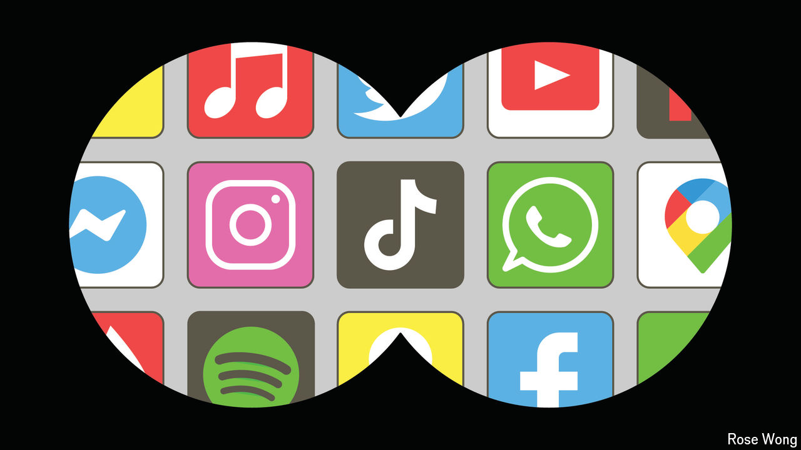

###### Storing up trouble

# App stores are hugely lucrative—and under attack 

##### Governments want to curb their power 

 

> May 13th 2024 

Since the first iPhone fell into people’s pockets in 2007, apps have steadily become the portal of choice to the digital world. The mobile devices on which they run now account for two-thirds of global internet traffic. Inhabitants of rich countries spend about five hours a day staring at apps—roughly a third of their waking lives. Around the world some 3.5bn people use them each month.

That has made the app stores that distribute them a lucrative business for Apple and Alphabet, the tech titans whose iOS and Android operating systems power the vast majority of the world’s mobile devices. That, in turn, has drawn the attention of . They are leaning on the duopoly to limit access to disfavoured apps while at the same time working to loosen its stranglehold over the market. They risk irking consumers on both counts.

