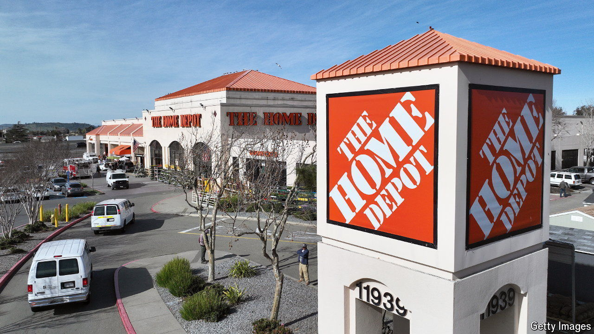

###### Through the floor

# Can Home Depot’s “amazing era” return? 

##### Americans are yet to recover their enthusiasm for renovations 

 

> May 15th 2024 

The origins of Home Depot, a big American home-improvement store, are inauspicious. In 1978 two of its co-founders were fired from senior roles at Handy Dan’s, a similar chain in southern California, in a power struggle. They decided to start a rival firm. In an effort to lure in customers on opening day, the co-founders’ children stood outside the doors and handed out dollar bills. “By dinner time they still had plenty of cash,” lamented Bernie Marcus, one of the co-founders, in his autobiography. 

Today the company is a giant. Over the past 12 months it racked up $150bn in sales, making it by far America’s biggest home-improvement chain and its third-largest bricks-and-mortar retailer, after Walmart and Costco. The company now employs half a million staff, who profess to “bleed orange”, a reference to the firm’s striking colour scheme. Its market value, at $350bn, exceeds that of Chevron, an oil giant, and Netflix, a streaming darling.

