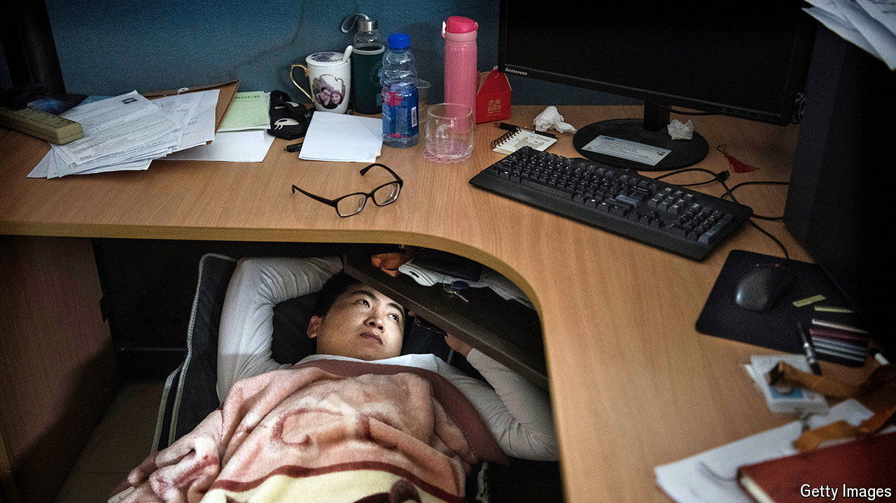

###### Clocked off

# China’s youth are rebelling against long hours 

##### The backlash over a series of viral videos says a lot about shifting attitudes 

 

> May 16th 2024 

It is a time-honoured tradition for bosses to grumble about the supposed laziness of their underlings. Doing so publicly, however, is rarely wise. China offers no exception to this rule. Earlier this month Qu Jing, the head of communications at Baidu, a local tech giant, took to social media to defend the company’s gruelling culture. The resulting firestorm has highlighted the growing dissatisfaction among China’s young white-collar workers with the punishing hours common in the country.

In one video, which soon went viral, Ms Qu said it was not her responsibility whether her team’s relationships or health were affected by their jobs, declaring “I’m not their mother.” In another she added that a woman who opts to spend time with “her husband and kids” should not expect a promotion or raise. She claimed that she did not regret forgetting her elder son’s birthday nor which grade her younger son was in at school because she “chose to be a career woman”. “Keep your phone on 24 hours a day, always ready to respond,” was her advice to those lucky enough to find themselves in her line of work.

