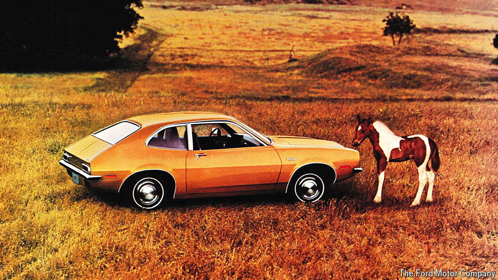

###### Marque to market

# How not to name a new car 

##### Companies that get it wrong risk both derision and outrage 

 

> May 16th 2024 

Bestowing a name on a car, as on a child, is not to be taken lightly. By naming his newest progeny X Æ A-XII, Elon Musk has condemned the boy to a lifetime of befuddled attempts at pronunciation (“ex ash ay twelve”, for those wondering). Naming the first four models produced by Tesla, his car company, S, 3, X and Y was equally asinine.

Yet model names that provoke derision or outrage are surprisingly common in the car business. The Ora Funky Cat, from a sub-brand of China’s Great Wall Motors, was recently renamed the Ora 03, ostensibly as part of a new global brand strategy but mainly because it sounded daft. Peugeot’s Bipper Tepee, now discontinued, was about as bad. (Peugeot is owned by Stellantis, whose largest shareholder, Exor, part-owns .) The Nissan Cedric, a large saloon on sale from 1960 until 2004, sounded like it belonged in the previous century. It eventually became the Datsun 200 series in many overseas markets. 

