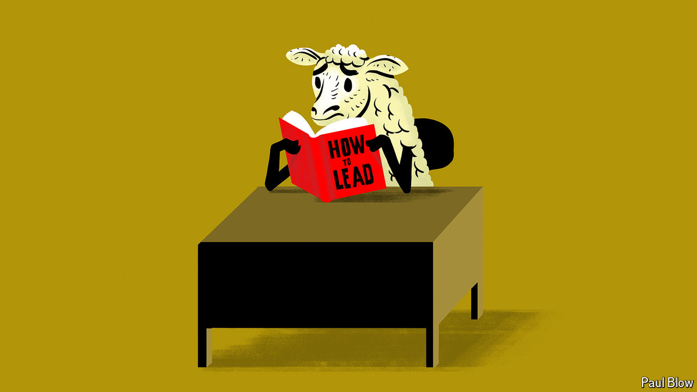

###### Bartleby

# How to be a good follower 

##### First, realise that it matters 

 

> May 16th 2024 

If there is one thing anyone with a job and a pulse needs to learn, it is how to lead. That, at least, is the message from the tsunami of books, courses, videos and podcasts on the topic. Business schools offer all kinds of leadership training. Authors pump out books instructing you to eat last, be daring and take leaps—which risks stomach ache if nothing else. Gurus tell you how to lead without actually being a leader; you might be on the reception desk, but you’re really in charge. 

Missing in all this is an inconvenient fact. Most people in the workforce are not leaders and pretty much everyone reports to someone else. The most useful skill to have in your current job may well be how to be a good follower. 

