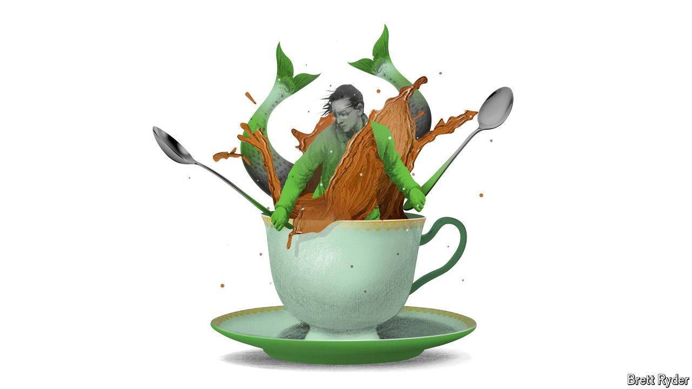

###### Schumpeter

# What do Joe Biden and the boss of Starbucks have in common? 

##### Both are grappling with gloomy consumers at home and trouble abroad 

 

> May 16th 2024 

IN Thomas Babington Macaulay’s “History of England”, the bustling coffeehouses of the 17th century were “the chief organs through which the public opinion of the metropolis vented itself”. But what happens when the metropolis stays away? Laxman Narasimhan, boss of Starbucks, the world’s mightiest coffee chain, is finding out the hard way.

Mr Narasimhan has been in the top job barely a year. He inherited sluggish growth in China and a unionising workforce in America. Since then, things have got much worse. During the first quarter sales in America declined by 3%, year on year, and the firm slashed its profit guidance for the rest of 2024. Long wait-times and unavailable products meant around 15% of customers using the firm’s mobile app did not bother to complete their order. Starbucks’ share price has fallen by a fifth this year. To cap it all off, on May 5th Howard Schultz, the caffeine king who grew the chain from obscurity to ubiquity, condemned the firm’s recent performance in a post on LinkedIn.

