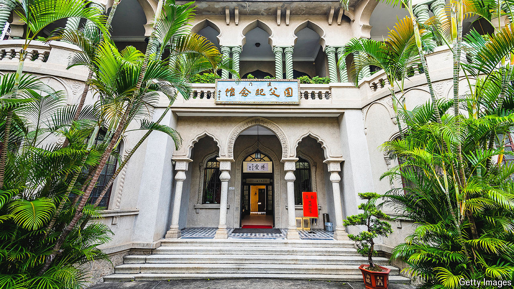

###### Where Sun never sets

# How Taiwan still hangs on to property in bits of China 

##### Reverence for a pre-Communist leader may make China stay its hand 

 

> May 16th 2024 

THERE ARE few places within China’s borders where displaying Taiwan’s national flag is allowed. One is the Sun Yat-sen Memorial House, a museum in Macau where more than a dozen Taiwanese standards are on display. Some are near the entrance and visible to pedestrians outside. There are also two enormous posters that declare Taiwan “the Heart of Asia” (a Taiwanese tourism logo). In a reading room one finds newspapers and magazines published by Taiwan’s government.

There is a rather simple—yet surprising—explanation for all this. Even though China’s leaders in Beijing claim Taiwan as their own territory, Taiwan’s government can still own property in corners of Hong Kong and Macau. The Sun Yat-sen Memorial House is one such piece of real estate. It is devoted to the man who has been dubbed “the father of modern China”. Sun overthrew the Qing dynasty in 1911, occasionally using Macau as a base for his activities. 

