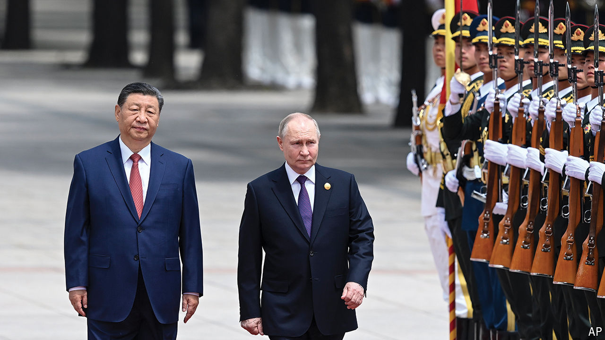

###### An autocratic bromance

# The Xi-Putin partnership is not a marriage of convenience 

##### It is one of vital, long-term necessity 

 

> May 14th 2024 

IN MARCH LAST year China’s leader, Xi Jinping, paused at the door of the Kremlin. Before bidding farewell to Vladimir Putin, he offered him a final thought. Using the phrase , shorthand for what China views as a historic change in the world order, Mr Xi said: “Let us promote it together.” On May 16th the two leaders met for the 43rd time. Russia has become an ever more important partner in China’s push against American might. Economic ties have been growing stronger and there are signs of deepening military links. So far this month America has twice tightened sanctions on Sino-Russian trade. Mr Xi’s government has responded furiously, urging the West to “stop smearing and containing China”. 

China is Mr Putin’s first destination abroad after a sham election in March that gave him a fifth term as president. There is a symmetry of sorts with the meeting in 2023. That came just after China’s parliament had given its rubber-stamp approval for Mr Xi to break precedent and serve a third term as president, and days after the International Criminal Court issued an arrest warrant for Mr Putin for war crimes in Ukraine. For both men their encounters are a display of contempt for the West’s efforts to hobble autocrats.

