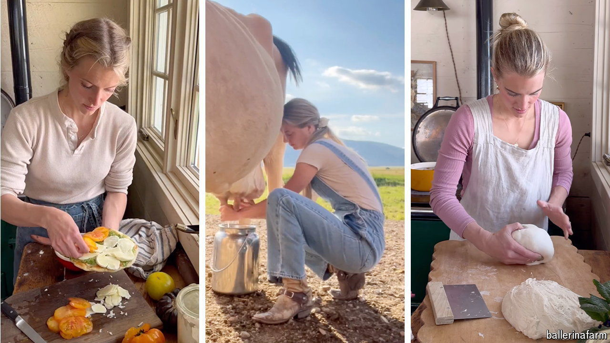

###### Honey, will you be home for dinner?

# #Tradwives, the real housewives of the internet, have gone viral 

##### Why social-media users are riveted by the domestic toil of homemakers 

 

> May 15th 2024 

HOW LONG does it take to make a grilled-cheese sandwich? The answer, for most, is about ten minutes. But for Hannah Neeleman, a housewife-turned-social-media-star, the process can take days. Ms Neeleman (pictured) makes everything from scratch: milling her own flour and milking cows. Then she performs a fiddly routine of stirring and simmering. Finally, exhausted, she stuffs homemade cheese into freshly baked bread and tells her eight children to tuck in. 

When she is not busy making sandwiches, Ms Neeleman posts videos of them on TikTok, a social-media app (her grilled-cheese recipe has more than 50m views). She is part of a cohort of “traditional” housewives who show women how to look after their homes and husbands, make wild blueberry compotes, wear floral frocks and use words like “fresh” and “frolicking”. The hashtag #tradwife has been viewed more than 600m times on TikTok. 

