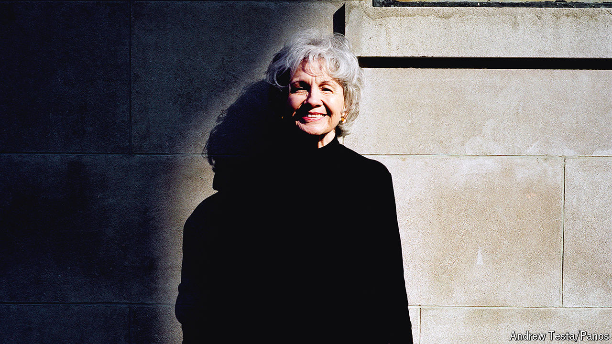

###### A literary life

# Alice Munro was the English language’s Chekhov 

##### The Nobel prizewinning short-story writer died on May 13th, aged 92 

 

> May 15th 2024 

“Promise me you’ll boil the water you drink. And you won’t marry a farmer,” says a character in . Instantly, the reader is in Alice Munro territory: spinsters with lingering illnesses and stifled passions, jealous married women scrubbing floors, inky veins protruding from their legs. Light falls constantly on the domestic: a gas stove in the kitchen fed with quarters, a dining-room table with a lace cloth on it, a ceramic swan reflected in an octagonal mirror. But there is always something savage lurking beneath the veneer of gentility. Certain themes recur—of drowning, regret, longing and the cruelty of lovers. 

The daughter of a silver-fox and mink farmer, Ms Munro (pictured) was brought up in rural Ontario. As a girl, she was told that the worst thing you could do was to “call attention to yourself” or “think you were smart”. She enrolled at the University of Western Ontario to study journalism but dropped out when her scholarship money dried up. Ms Munro married young and moved to Vancouver, where her husband worked as a manager in a department store. She had four daughters. One, born with defective kidneys, died in infancy. 

