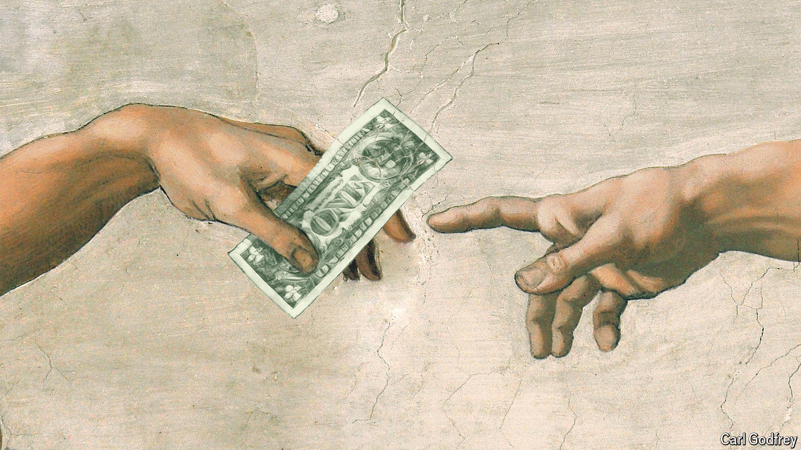

###### Money and faith

# God™: an ageing product outperforms expectations 

##### An economist tries to explain religion 

 

> May 14th 2024 

By Paul Seabright. 

God gets mixed reviews on Amazon. This is perhaps surprising. His marketing campaign (now in its third millennium) has been strong. His slogans (“God is Great!”) are positive. And indeed many shoppers effuse. “Wonderful!” reads one five-star review beneath His best-known work, the Bible. “Beautiful,” says another. “Amen,” adds another satisfied customer.

