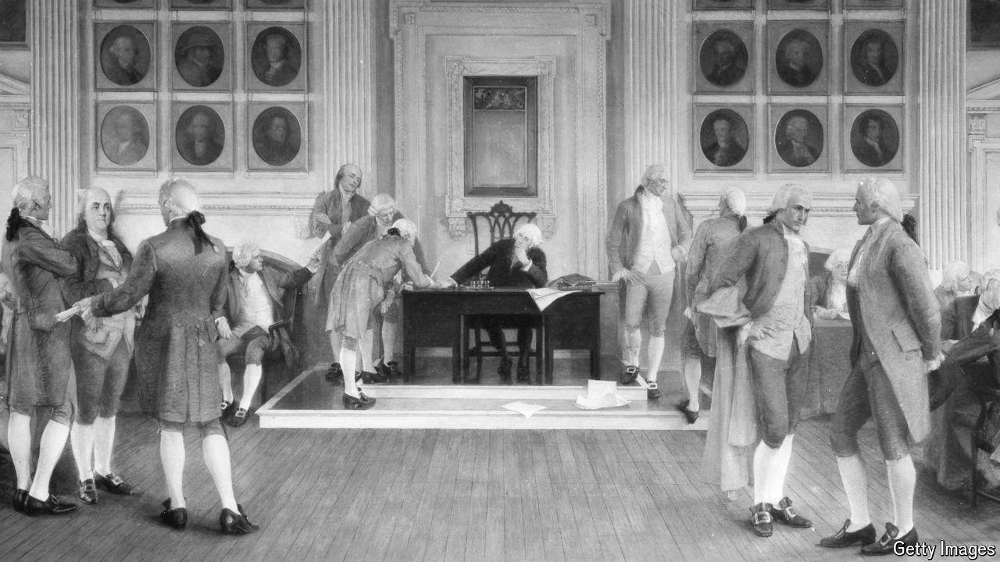

###### Originalist to the core

# How did the Founding Fathers want Americans to behave? 

##### A journalist tries to figure out what it means to “live constitutionally” 

 

> May 16th 2024 

By A.J. Jacobs. 

Should the constitution be interpreted as it was understood at ratification in 1788? Just a few decades old,  is in vogue on America’s conservative Supreme Court, influencing rulings on abortion, gun rights, environmental regulation and the separation of church and state. A.J. Jacobs, an editor-at-large for  magazine, decided to live as the Founding Fathers supposedly wanted Americans to. For a year he would “walk the walk and talk the talk and eat the mutton and read the ”.

