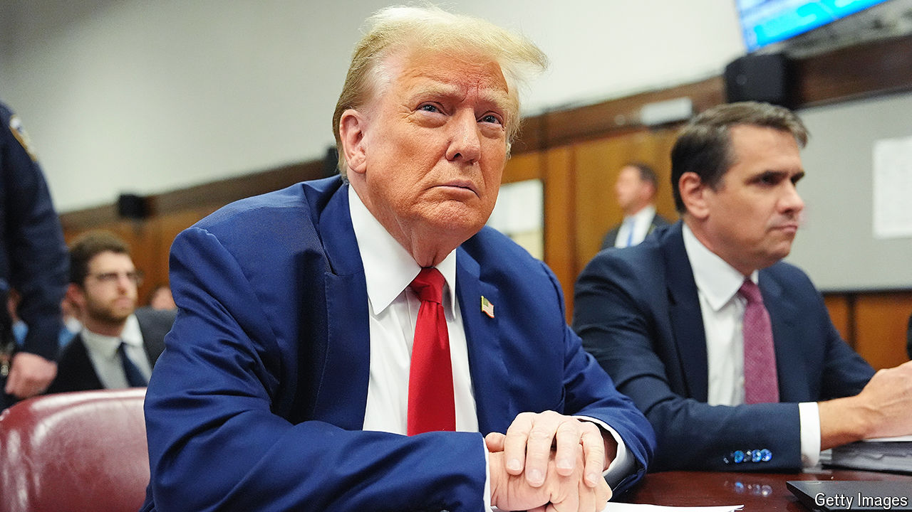

###### Back Story

# The trial of Donald Trump, considered as courtroom drama 

##### Sensational witnesses, high stakes—it has the classic elements. Sort of 

 

> May 10th 2024 

An innocent man in fear of his life faces a biased jury (“To Kill a Mockingbird”). A guilty man is acquitted after shocking revelations from his wife (“Witness for the Prosecution”). In , an adult-film star confronts a once and possibly future president who, she claims, stripped to his underwear while she used the bathroom in a hotel suite in Lake Tahoe.

As film-makers have always grasped, a courtroom is inherently theatrical. It brings adversaries into uncomfortable proximity. Emotional and ethical depths are plumbed, but decorum must be maintained. Mr Trump is charged with falsifying documents to cover up a payment in 2016 to , who says she had sex with him a decade earlier (he denies all of it). The case has many vital elements of courtroom drama, only slightly askew. 

