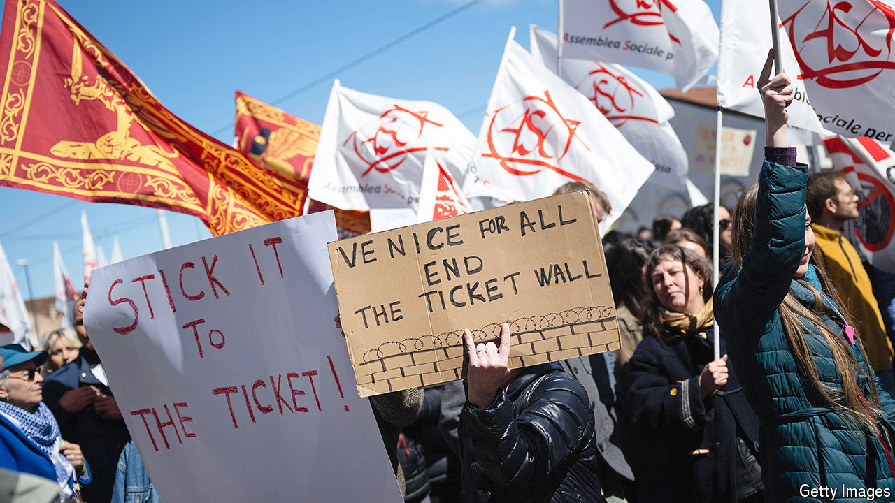

###### Mass tourism

# Venice’s new admission fee cannot curb overtourism 

##### It is too low, and there are too many exemptions 

 

> May 13th 2024 

VENICE HAS never been more full—or more empty. In 2022 the population of  dropped below 50,000, down from 175,000 in 1951. But as residents leave, tourists flow in. Some 20m-30m people visit every year, most for day trips, and crowd the historic city’s eight square kilometres. They rarely visit cultural sites: only around 360,000 go to the Gallerie dell’Accademia, one of the city’s major art museums. Officials complain of “hit-and-run” tourists who come for a few hours, dump their rubbish and then go home. 

So the city has introduced the tourism equivalent of a short-stay parking fare. Venice has started charging an “access fee” of €5 ($5.41) to day-trippers, becoming the first city in the world to do so. A host of other places, including Berlin, Lisbon and Vienna, have a “tourism tax” on overnight guests; this is the first for flying visits.

