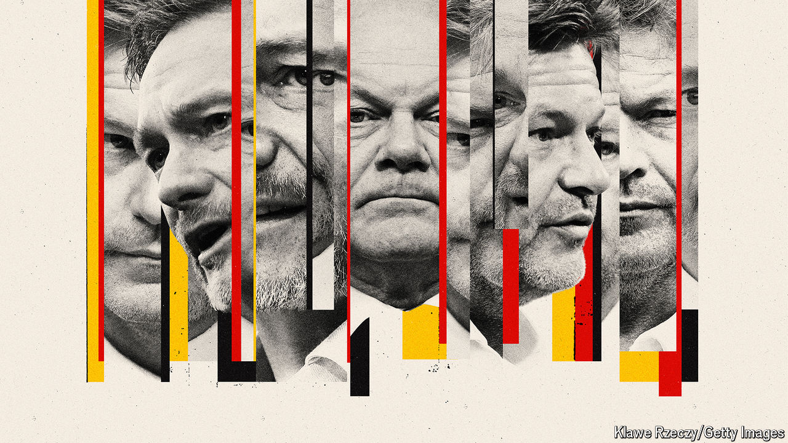

###### Three-body problem

# Germany’s government is barely holding together 

##### The mood in the country is miserable—and it is getting worse 

 

> May 15th 2024 

VISITORS to Germany’s capital may mistake the  (literally “snout”), an earthy form of local wit, for grumpiness. But there is no misreading the mood in Germany today. A deep malaise has settled on the country. Four-fifths of Germans tell pollsters they are unhappy with their rulers. And a series of upcoming political and electoral trials could test the government to breaking-point.

In December 2021, after an election delivered a fragmented parliament, the Social Democrats (spd), Greens and the pro-business Free Democrats (fdp) yoked themselves together in Germany’s first three-party coalition for more than 60 years. After 16 stable but uninspired years under Angela Merkel, the parties in the coalition, so named because their colours mimic a traffic light, seemed to promise a throupling that would bring excitement and new ideas. Climate change would make awesome demands of Germany’s industrial economy, and the country’s creaking bureaucracy needed yanking into the 21st century. The three parties might not agree on every policy, but shared a commitment to modernising the country. 

