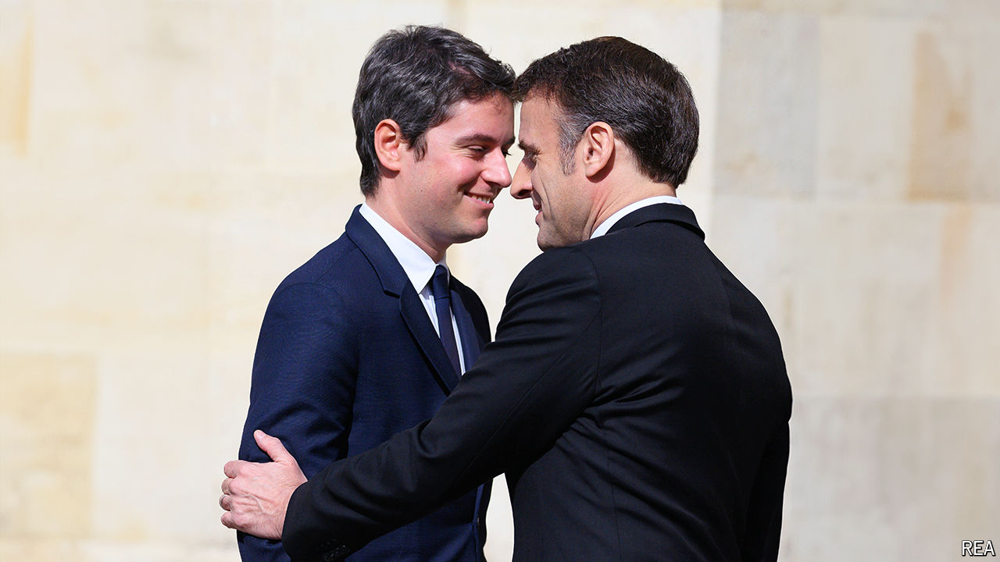

###### Gabriel Attal

# Meet Gabriel Attal, France’s young prime minister 

##### The challenge for Macron’s mini-me 

 

> May 12th 2024 

Standing side by side at a war memorial in Ottawa, two leaders prepared to lay a wreath in honour of their countries’ fallen soldiers. The Canadian, Justin Trudeau, was once one of the West’s youngest leaders. The Frenchman, Gabriel Attal, is France’s youngest modern prime minister. As he stepped forward the 35-year-old Mr Attal glanced, more than once, at his elder counterpart for protocol cues. On his first official trip outside Europe, the fresh-faced French leader was on full display and did not want to put a foot wrong. 

Mr Attal was propelled into his new job by  in January, in an attempt to reboot an ailing government. Since then, the prime minister has faced a string of troubles, from angry farmers and teenage ultra-violence to deteriorating public finances. His recent trip to Canada provided a welcome break. Mr Attal got to discuss geopolitics with Mr Trudeau, review Canadian troops, woo investors, sign autographs for schoolchildren and blush at a long standing ovation by the Quebec parliament. When it comes to Quebec’s status, the French tread on perilous diplomatic ground; Mr Attal dodged provocation. “He’s a fast learner, and not just about protocol,” notes a French minister.

