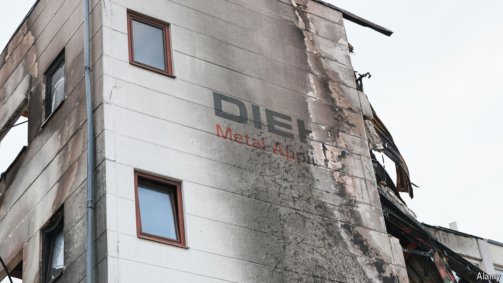

###### Active measures

# Russia is ramping up sabotage across Europe 

##### The Kremlin believes it is in a shadow war with NATO 

 

> May 12th 2024 

THE FIRE that broke out in the Diehl Metall factory in the Lichterfelde suburb of Berlin on May 3rd was not in itself suspicious. The facility, a metals plant, stored sulphuric acid and copper cyanide, two chemicals that can combine dangerously when ignited. Accidents happen. What raised eyebrows was the fact that Diehl’s parent company makes the IRIS-T air-defence system which Ukraine is using to parry . There is no evidence that this fire was an act of sabotage. If the idea is plausible it is because there is ample evidence that Russia’s covert war in Europe is intensifying. 

In April alone a clutch of alleged pro-Russian saboteurs were detained across the continent. Germany arrested two German-Russian dual nationals on suspicion of plotting attacks on American military facilities and other targets on behalf of the GRU, Russia’s military intelligence agency. Poland arrested a man who was preparing to pass the GRU information on Rzeszow airport, the most important hub for military aid to Ukraine. Britain charged several men over an earlier arson attack in March on a Ukrainian-owned logistics firm in London whose Spanish depot was also targeted. The men are accused of aiding the Wagner Group, a mercenary group that has been active in Ukraine and is now under the GRU’s control. On May 8th Britain announced that in response to “malign activity” it was, among other steps, expelling Russia’s defence attaché, an “undeclared” GRU officer.

