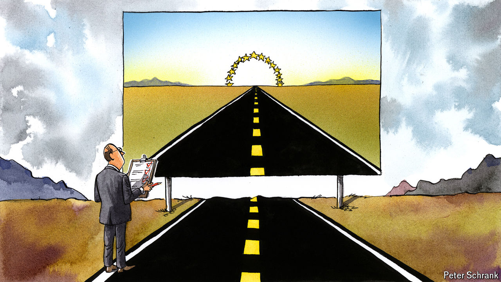

###### Charlemagne

# The EU’s best-laid plans for expansion are clashing with reality 

##### For now “phoney enlargement” is the order of the day 

 

> May 16th 2024 

After the fall of Poland at the start of the second world war, a paradoxical peace reigned. Carnage was on the cards, but not quite yet. The “phoney war” lasted for eight months, ending when Germany invaded its western neighbours. Today the European Union is going through a “phoney enlargement”. On paper up to nine countries are making progress towards membership. Both in the capitals of the countries looking to join and in Brussels, officials say preparations are being made, reforms enacted, boxes ticked. But whether the mooted expansion will happen is still doubtful. A flush of enthusiasm in the wake of Russia’s invasion of Ukraine has given way to the realisation that the journey from 27 to 36 will be long and uncertain. A target of 2030 used to be seen as aspirational. It now looks delusional. 

Events in recent days show why. A slew of countries that have applied to join the EU have demonstrated why they are not yet members. In Georgia a repressive “foreign agent” law that mimics the manner Russia once cracked down on civil society was approved by parliament on May 14th despite vast protests. Georgians overwhelmingly want a European future but are governed by an oligarchic caste that favours rapprochement with the Kremlin, not Brussels. A few days earlier a new nationalist president took office in North Macedonia, one of six western Balkan aspirants to EU membership. Instead of reciting the usual platitudes in her inaugural speech, Gordana Siljanovska-Davkova referred to her country merely as “Macedonia”, thus knowingly blowing up a deal with Greece, which worries its neighbour’s use of the name will one day degenerate into territorial claims on its region of that name. This pact had been a prerequisite for it to become a candidate for EU accession. And on May 8th Serbia announced a “shared future” with China as it greeted Xi Jinping with great pomp in Belgrade. It will soon enact a free-trade agreement with China that is completely incompatible with EU membership.

