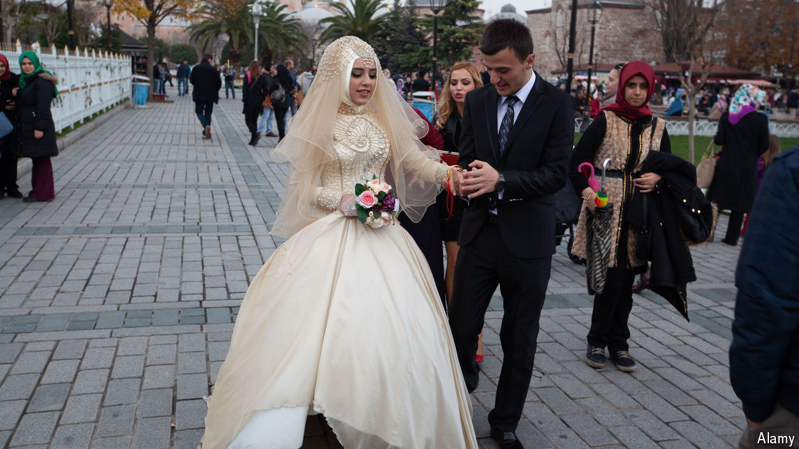

###### What’s in a name?

# Turkish women should soon be allowed keep their maiden names 

##### But the law is still fuzzy 

 

> May 16th 2024 

AYSE CICEK is not particularly fond of her surname, which means “flower” in Turkish. But she was even less pleased at the prospect of being forced to change it. In 2022, when she got engaged, Turkish law decreed that she would have to take her fiancé’s surname on marriage, or double-barrel it with her maiden name.

For Ms Cicek, 34, who works at a Turkish airport, that is problematic. It would mean changing four different security cards for her workplace, as well as her passport, driving licence, bank cards and national ID. It is also an issue of principle. “A woman should not have to change her identity just because she has married,” she says. Feminists have campaigned against the law for decades, arguing that it clashes with the provisions in the Turkish constitution that enshrine equality between the sexes. Women have also surged into the workforce since the rule came in with Kemal Ataturk’s drive to Europeanise his new state. The justification for forcing women to take their husband’s name was to keep records and lines of lineage clear.

