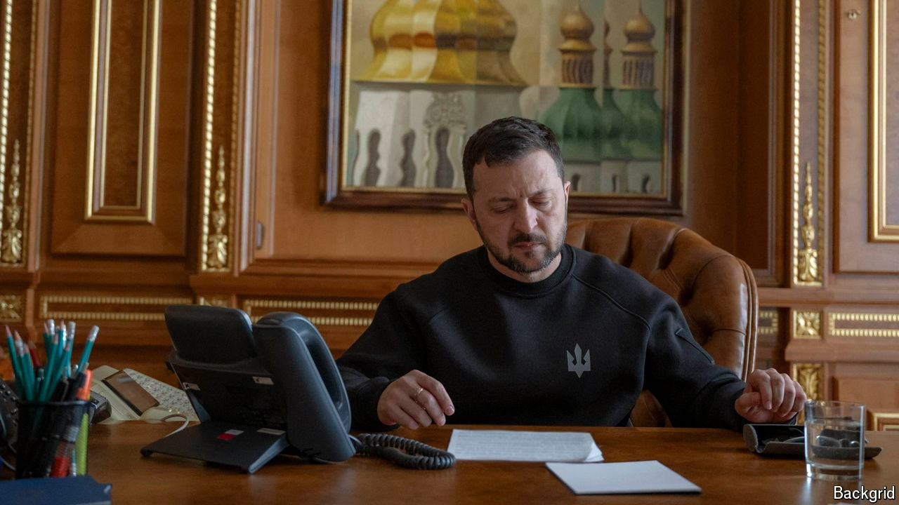

###### Time’s up

# Volodymyr Zelensky’s five-year term ends on May 20th 

##### But he has no plans to step down or call an election during wartime 

 

> May 16th 2024 

FIVE YEARS ago, on May 20th, 2019, a fresh-faced Volodymyr Zelensky began his presidency with the offer of a contract to his people. “Each of us is the president,” he said from the rostrum of parliament. “This is our joint victory and chance…and joint responsibility.” The intervening years have not been kind, to him or Ukrainians in general. First came the crisis of Donald Trump and “Ukrainegate”, then covid-19, and then Russia’s terrifying full-scale invasion. By surviving this far, Mr Zelensky has already written himself into history. But as problems worsen on the front lines, the Ukrainian president may be about to face his biggest political challenge yet: renewing his contract with his people with no obvious possibility of elections. 

The mood in Kyiv is increasingly angsty, with Mr Zelensky’s opponents muttering that his monopoly on power is no longer tenable. Some are already playing the May 21st card, arguing that he loses political authority as soon as his scheduled five years are up. The Kremlin, unsurprisingly, agrees with them. “Zelensky’s fate is predetermined…many will question his legitimacy,” said a spokesman in April. Belarus’s Moscow-aligned president, Alexander Lukashenko, has even cast doubt on Mr Zelensky’s ability to be a legitimate signatory in any future peace deal, rich from a man who stole his way to re-election in 2020. 

