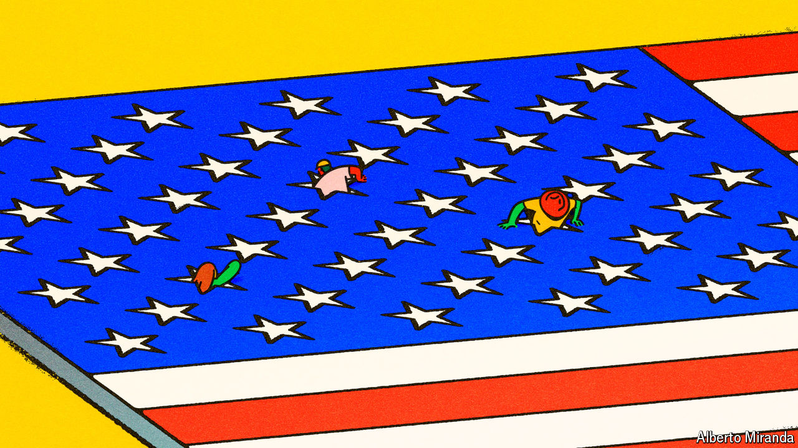

###### Go get ‘em

# America is in the midst of an extraordinary startup boom 

##### How the country revived its go-getting spirit 

 

> May 12th 2024 

Pearls, it is said, represent purity. They may soon stand for something else: business dynamism. In Greenville, South Carolina, two locals have created earrings that look like jewels, but contain a cluster of electronics to track body temperature, heart rate and even the wearer’s menstrual cycle. Incora Health was set up in 2022. It plans to start selling its earrings, currently in clinical trials, in a few months. “We’re first-time founders in a small city trying to change women’s health care, and that’s not lost on us,” says Theresa Gevaert, a co-founder. But the audacious young firm is part of a wave of startups that have been launched in America in the past few years. Many will fail. Some will succeed. Together they suggest change is afoot.

Although America has a deserved reputation as a country at the cutting edge of innovation, fuelled by entrepreneurial vim, in recent years some economists have worried this reputation no longer holds true. Startups have formed a smaller and smaller portion of the business landscape: in 1982 some 38% of American firms were less than five years old; by 2018, 29% were that young. The share of Americans working for startups likewise fell. Silicon Valley sizzled with high-tech wizardry, but its giant companies hoarded the best researchers, leading to a slower spread of new ideas throughout the country. Researchers, including at the Federal Reserve, pointed to this decline in dynamism as a cause of America’s weaker productivity growth.

