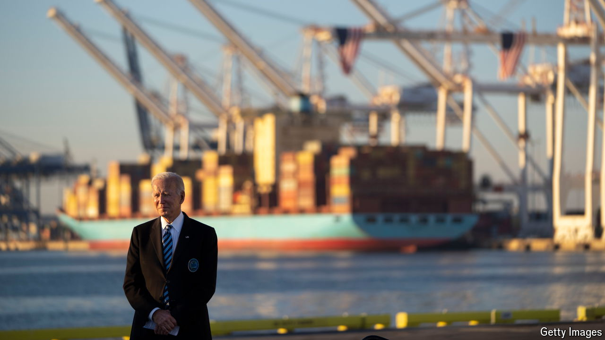

###### The 100% manoeuvre

# Biden outdoes Trump with ultra-high China tariffs 

##### The move, which hits electric vehicles, carries an environmental cost 

 

> May 14th 2024 

Just over six years ago, when Donald Trump first announced , it was as if a bomb had gone off. American stocks fell sharply at the prospect of a trade war, businesses warned of blowback and economists lined up to decry the move. Such is the protectionist mood in Washington now that Joe Biden’s announcement of new measures has been met with rather less panic—even though it concerns significantly higher tariffs.

On May 14th, following a policy review, the White House decided to raise tariffs on, among other things, Chinese semiconductors and solar cells from 25% to 50%, syringes and needles from 0% to 50% and lithium-ion batteries from 7.5% to 25%. It hit electric vehicles (EVs) with the biggest increase of all, quadrupling the tariff rate on  from 25% to 100%. Lael Brainard of the National Economic Council said the actions would create “a level playing field in industries that are vital to our future”. Yet it is American consumers who will pay the price.

