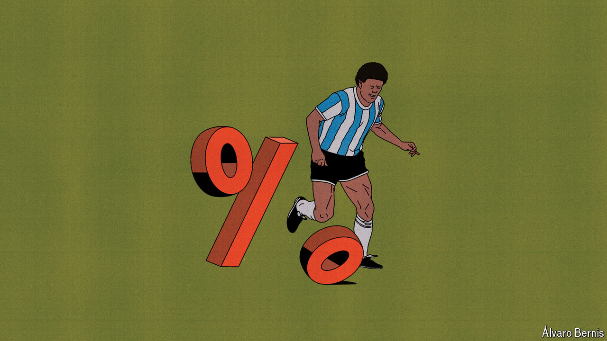

###### Free exchange

# Diego Maradona offers central bankers enduring lessons 

##### Recent years ought to have reduced the importance of a skilful feint. They have not 

 

> May 16th 2024 

Speaking in 2005, Mervyn King, then governor of the Bank of England, outlined his “Maradona theory of interest rates”. The great Argentine footballer’s performance at a World Cup match against England in 1986, Lord King argued, was the perfect illustration of how central bankers ought to conduct monetary policy. Running 60 yards from inside his own half, Maradona skipped past five opponents, including England’s goalkeeper, before slotting the ball home. Even more astonishing, he mostly ran in a straight line. By duping defenders into thinking he would change direction, he scored while scarcely having to do so. To Lord King, the lesson for central bankers was clear. Guide investors’ expectations of future interest rates deftly enough, and an inflation target can be met without changing the official rate at all.

For much of the intervening period, the Maradona theory has reigned supreme. After the global financial crisis of 2007-09, and again during the covid-19 pandemic, central banks’ policy rates spent long spells close to zero, as officials sought to stimulate their economies. Unable to force short-term interest rates much lower, many plumped for a Maradona-esque solution: assuring investors that they had no intention of raising policy rates any time soon. Quantitative easing (QE) programmes, which bought large volumes of bonds with newly created reserves, reinforced this signal by ensuring central banks (or the governments indemnifying them) would take heavy losses if they raised rates. The ball hit the net, and long-term yields dropped to historic lows.

