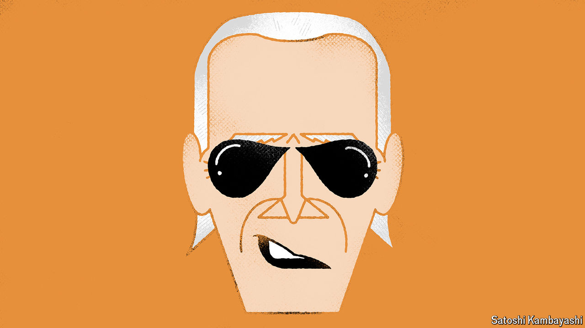

###### Buttonwood

# Joe Biden, master oil trader 

##### The president has turned volatility into profit 

 

> May 16th 2024 

He has a high-stakes job. War and natural disasters keep him on his toes. He is often on a plane to far-flung places, travelling to negotiate with local leaders. He has the best intelligence money can buy. And as November’s election nears, he will spend lots of time looking at lines on charts. The American president and swashbuckling oil traders, it turns out, have a lot in common.

Indeed, Joe Biden also seems to have a knack for the oil trade. Two years ago his administration initiated the largest ever sell-off from America’s Strategic Petroleum Reserve (SPR), an emergency store of crude oil, to counteract price surges caused by Russia’s war in Ukraine. Back then, dwindling stocks left observers twitchy. What if there was another shock to the system? So far, however, Mr Biden has got away with the gamble. He is now refilling America’s tanks, and began a new round of bidding on May 7th. Although inflation and war have marked his presidency, domestic fuel prices have been relatively stable and American production high. 

