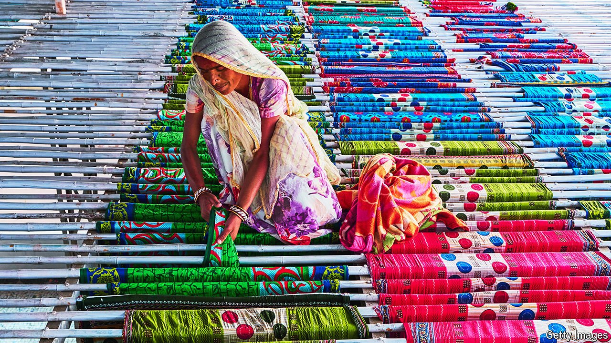

###### India’s economy

# Narendra Modi’s flagship growth scheme is off to a sluggish start 

##### Without improvements, it risks wasting trillions of rupees 

 

> May 16th 2024 

In the early 1990s India abandoned the principles of , or self-sufficiency, that had guided its policies since independence. Subsidies were scrapped; import levies tumbled. By 2014 the average tariff had fallen to 13%, from 125% in 1991. Over the same period, exports soared.

Yet the country’s exports remain a little lopsided for the tastes of Narendra Modi, who is currently seeking (and likely to obtain) a third term as prime minister. Although India is a services superpower, it plays only a small role in global manufacturing supply-chains, including for generic drugs and phones. Indeed, over the past decade, its share of global goods exports has stagnated at around 1.8%. 

