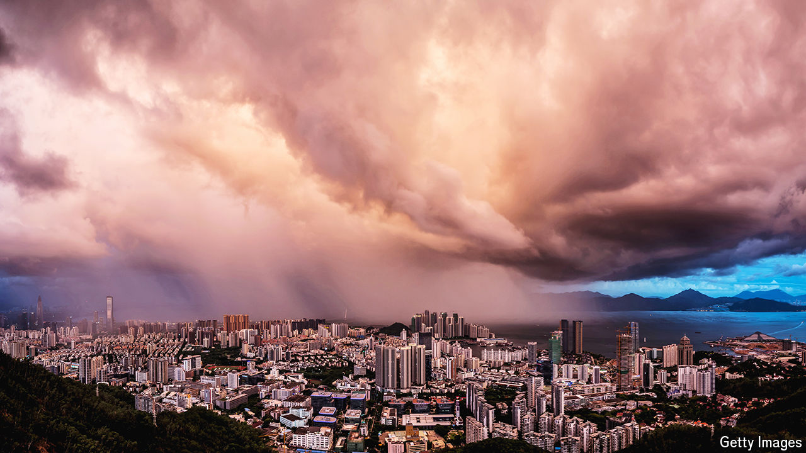

###### Sleepless in Shenzhen

# The property firm that could break China’s back 

##### If Vanke collapses, so might confidence in the state’s management of the economy 

 

> May 16th 2024 

Land in Shenzhen, China’s southern technology hub, is scarce. Plots in years past have grabbed sky-high prices. But when Vanke, one of the country’s largest property firms, puts 19,000 square metres of land up for sale on May 18th, it will do so at a discount of 900m yuan ($125m), or 29%, on the price it paid seven years ago. The sale reeks of desperation. Vanke has been forced to flog its assets to pay its mounting debts. The company’s struggles are another sign of the worsening situation in China’s property industry. 

Four years into the crisis, the potential collapse of another Chinese real-estate giant may seem unremarkable. Evergrande, the world’s most indebted homebuilder, fell in 2021. Country Garden, once China’s biggest developer, followed suit in 2023. Yet Vanke is different. Shenzhen Metro, a state-owned firm, holds about a quarter of its shares. This has given it greater access to state funds than its purely private peers. Late last year it was also included on a list of “high-quality” developers to which the government encouraged bank lending. And still the firm is short on funds to pay down debts.

