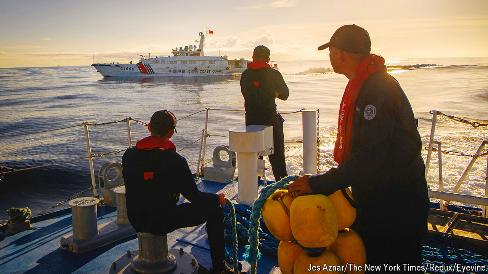

###### From grey zone to red zone

# Taiwan’s new president faces an upsurge in Chinese coercion 

##### But China’s bullying of Japan, Taiwan and the Philippines risks an explosion 

 

> May 16th 2024 

SAILING AROUND the northern point of Dadan island, the extent of the geopolitical challenge facing Taiwan becomes glaringly clear: to starboard a small military outpost guards Taiwan’s Kinmen islands and their 140,000-odd residents; to port a pair of curved skyscrapers tower over the Chinese city of Xiamen, whose 5m people stretch all round the bay.

So close are the two sides that the winners of an annual swimming relay race cover the few kilometres between them in less than 90 minutes. A Chinese takeover of Kinmen might not take much longer, such is the disparity in power. The boat’s owner is not keen on mainlanders fishing and dredging sand in Taiwan’s waters. But, having witnessed the artillery duels of the past, nor is he keen to fight to preserve his country’s democracy. “If Taiwanese soldiers left Kinmen, there would be no war,” he avers. And if China ruled Kinmen? “We would be richer and nobody would dare mess with us.” Such ambiguity in Taiwan gives China a vulnerability to try to exploit.

