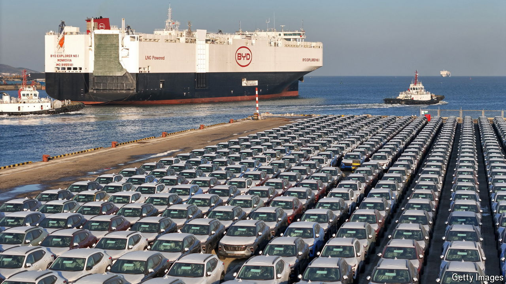

###### Biden’s baleful barriers

# America’s 100% tariffs on Chinese EVs: bad policy, worse leadership 

##### The global trade system is disintegrating as you read this 

 

> May 15th 2024 

Although it is unfashionable to say so these days, one of the great accomplishments of the past half-century was the remarkable decrease in global tariffs. This reduction, from average levies on imports of more than 10% in the 1970s to 3% today, helped fuel a boom in international commerce and a near-tripling in global GDP per person. The more that countries opened up, the more they flourished. So it is deeply regrettable that President Joe Biden has decided to  of 100% on  (EVs) made in China. 

Because trade benefits consumers broadly, but harms specific workers and companies that are able to organise resistance, it has always carried political costs. Today those costs loom large in politicians’ minds. The consensus required to underpin an open trading system is disintegrating, a process accelerated by the fact that China is not playing fair, as well as the rise of Donald Trump’s America-first vision. 

