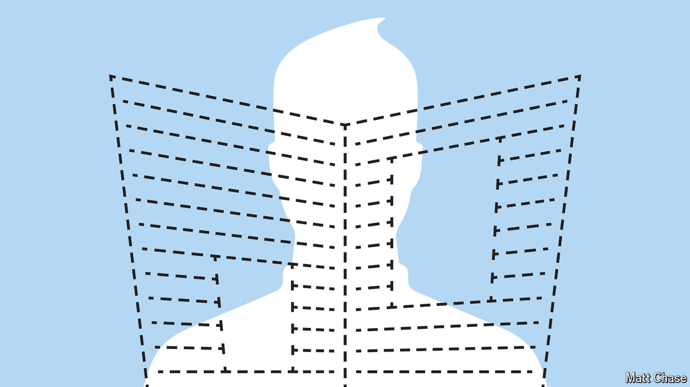

###### No news is bad news

# Canada’s law to help news outlets is harming them instead 

##### Funding journalism with cash from big tech has become a fiasco 

 

> May 16th 2024 

Three years ago journalists took unusual interest in an amendment to Australian competition law. The “news media bargaining code”, passed in 2021, obliged Google and Facebook to pay news outlets when search results or social-media feeds linked to their articles. Some wondered why the tech firms owed publishers money just for linking to their sites. But such doubts were quickly forgotten when the code wrung more than $100m out of the two tech giants in its first year. Other places rushed to copy it: Brazil, Britain, Canada, South Africa and California have explored similar measures.

The rationale for the bargaining code was always dubious. Forcing one company to pay another for linking to its site undermines a basic principle of the internet, not to mention free speech. It is hard to believe that news outlets are harmed by links to their stories appearing on Google and Facebook, the internet’s most powerful discovery mechanisms—especially when most news organisations have teams of people dedicated to making their stories spread as far as possible on the platforms. Nor is it clear why news publishers alone deserve to be paid for links, when no one else is. Bargaining codes look uncomfortably like a shakedown of foreign tech firms, urged on by domestic media sore about being out-competed in the digital advertising market.

