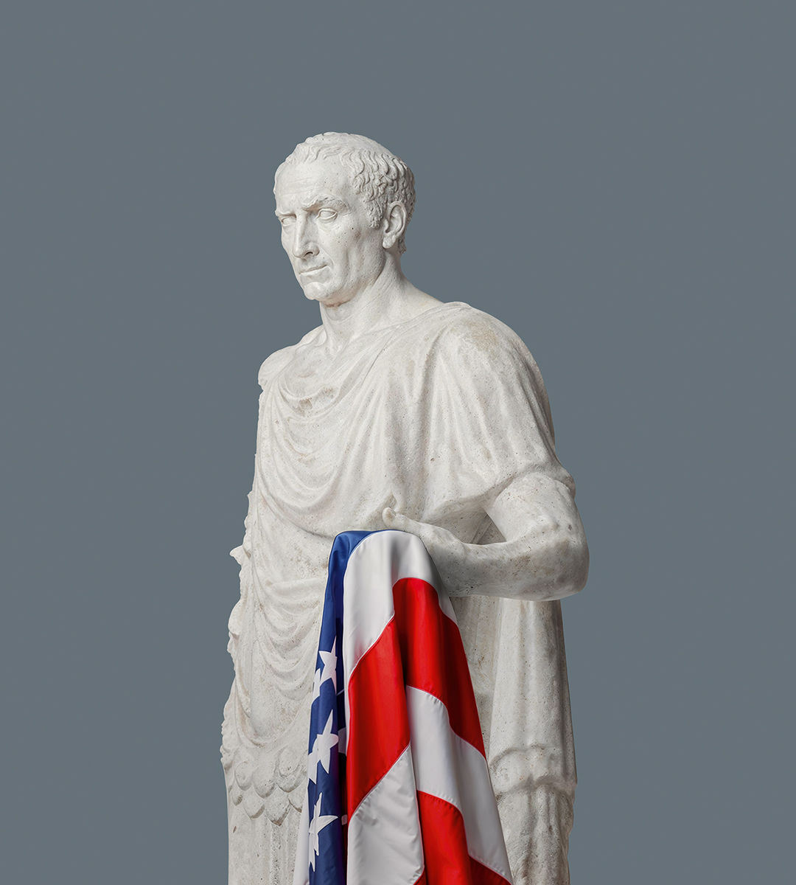

###### Democracy

# Is America dictator-proof? 

##### The many vulnerabilities, and enduring strengths, of America’s republic 

 

> May 16th 2024 

HOW HAS it come to this? After victory in the cold war, the American model seemed unassailable. A generation on, Americans themselves are losing confidence in it. Feckless war-making, a financial crisis and institutional rot have let loose a ferocity in America’s politics that has given presidential contests seemingly existential stakes. Americans have heard their leaders denounce the integrity of their democracy. They have seen fellow citizens try to block the transfer of power from one administration to the next. They have good reason to wonder how much protection their system guarantees them against the authoritarian impulse rising around the world.

The answer is that, if Americans believe that their constitution alone can safeguard the republic from a Caesar on the Potomac, then they are too sanguine. Preserving democracy depends today, as it always has, on the courage and convictions of countless people all across America—especially those charged with writing and upholding its laws.

