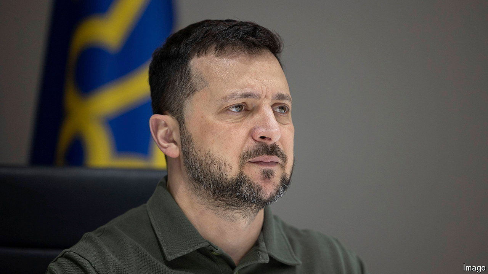

###### Five more years?

# Volodymyr Zelensky’s presidential term expires on May 20th 

##### What does that mean for his country? 

 

> May 16th 2024 

ABRAHAM LINCOLN won a presidential election in civil-war-torn America in 1864, and FDR secured his fourth term in 1944 while American troops were in action across the globe. Winston Churchill, by contrast, avoided the electorate until the war in Europe was over in 1945, at which point he was turfed out. Holding an election when enemies are occupying your territory or raining bombs on it, and when huge numbers of your citizens are away fighting, is tricky. Not holding one is tricky in a different way, opening those in power to the charge of illegitimacy. That is the bind that Ukraine’s president, , finds himself in, as his five-year term expires on May 20th. He cannot hold elections now, but he must prepare to hold them eventually.

Ukraine’s constitution is confusing. Article 103 states that the president is elected for a five-year term; but Article 108 says that he or she exercises power until a new president is inaugurated. A longstanding law (though not a constitutional provision) says that elections cannot be held when martial law is in force, as it has been in Ukraine since Russia began its full-scale invasion in February 2022. 

