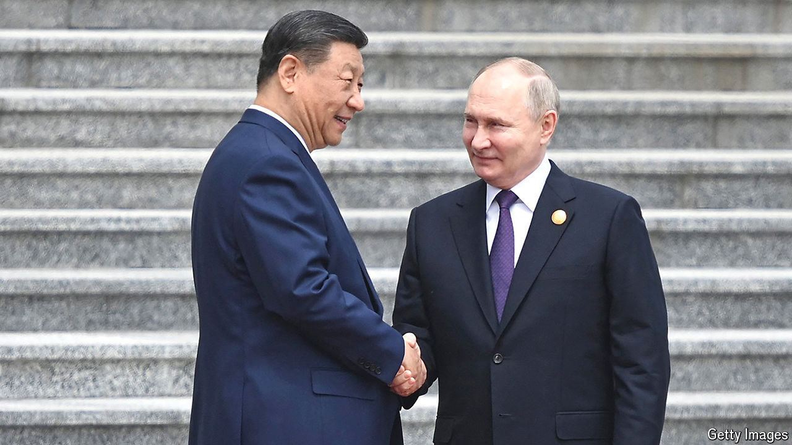

###### The challenge posed by China

# Xi Jinping is subtler than Vladimir Putin—yet equally disruptive 

##### How to deal with Chinese actions that lie between war and peace 

 

> May 16th 2024 

TWO YEARS after Xi Jinping declared a “no limits” partnership with Vladimir Putin, and as the leaders meet again in Beijing on May 16th and 17th, the world is getting a good look at what China’s approach means in practice. It is not pretty. As we explain this week, Chinese firms are sustaining Mr Putin’s war in Ukraine by selling Russia items needed to make weapons. China’s coastguard is bullying vessels in the South China Sea, enforcing its bogus territorial claims. And China’s spies are allegedly meddling in Britain and elsewhere. 

Mr Xi’s challenge to the world is more subtle than that posed by the warmongering Mr Putin. Yet it is still a problem. He craves a might-makes-right order, letting China do as it pleases. Its support for pariah states is meant to defy and divide the West, while avoiding a direct clash. Its “” in the South China Sea falls short of war, but is intended to weaken foes. China thinks these tactics can be sustained without tipping into conflict. The question for any country that supports global rules is how far to let Mr Xi go.

