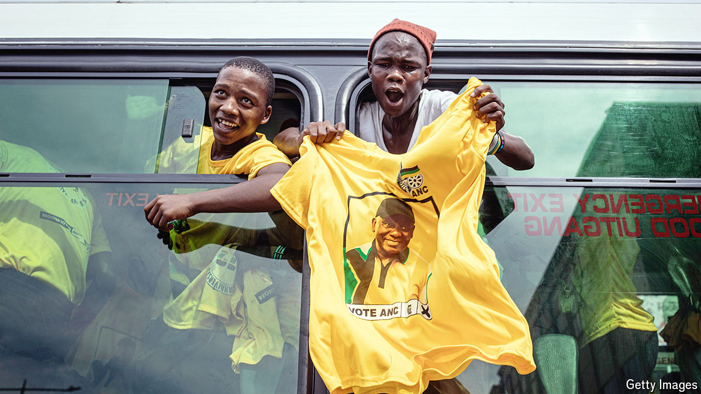

###### Slag to riches

# How a Russia-linked mine may keep the ANC in power 

##### South Africa’s ruling party was broke a few months ago, but its fortunes are changing 

 

> May 16th 2024 

JUST A FEW months ago the African National Congress (ANC) had the bailiff at its door. A court had ordered the seizure of assets from its headquarters over an unpaid 102m rand ($5.6m) bill for campaign posters produced for the previous election in 2019. It was not the first time of late that courts had been asked to force the ANC to pay up. In 2022 employees of the party, which has ruled South Africa for 30 years, sued over unpaid salaries. It was so broke that it said it was trying to find lawyers willing to work pro bono on its case. 

The latest cash crunch could not have been more dangerously timed. On May 29th the ANC will face its toughest general election since Nelson Mandela won power in 1994. Pollsters reckon its share of the national vote will fall below 50%, with recent surveys putting its support in the mid-40s. The higher its share, the more able the ANC will be to form a coalition with small parties in which it is dominant. A poorer showing would force it to share power with either the liberal opposition Democratic Alliance or with radical populists such as the Economic Freedom Fighters.

