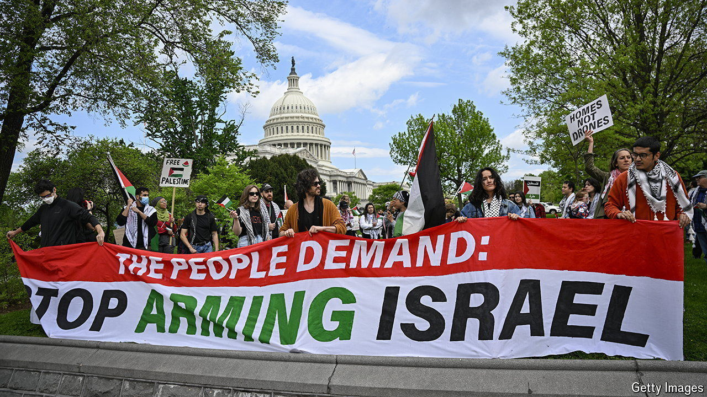

###### American arms to Israel

# Israel has seen arms embargoes before 

##### But this time it will struggle without American military support 

 

> May 16th 2024 

On may 8th President Joe Biden confirmed that his administration would withhold shipments of certain kinds of bombs if Israel extends its invasion of Rafah, Hamas’s last main stronghold in Gaza, where over a million civilians have taken shelter.

Israel has been here before. In 1969 Britain and France imposed arms embargoes and Israel found itself without its main suppliers of tanks, fighter-jets and warships. In response, it increased its purchases of American weapons while investing heavily in its own arms industry. To replace the embargoed British Chieftain tank, it built the formidable Merkava, updated versions of which are currently being used in Gaza.

