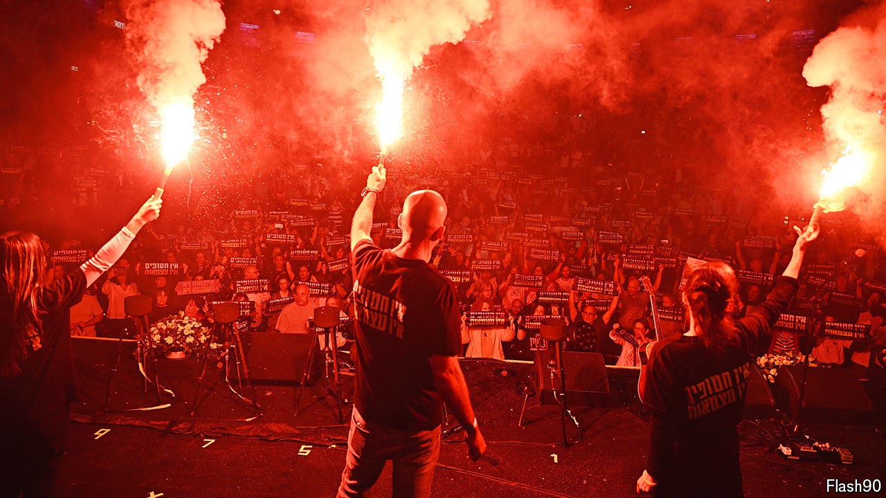

###### The Hamas-Israel conflict

# On Independence Day Israel is ripping itself apart 

##### Anger, tears and recriminations 

 

> May 14th 2024 

THE TORCH-LIGHTING which traditionally opens Israel’s Independence Day was broadcast on the evening of May 13th as usual. But instead of being televised live as before, the event was pre-recorded. The government said this was because of the solemnity of holding the ceremony while the nation is at war. The real reason, however, was the politicians’ fear that it would be disrupted by protesters, furious with their failings in handling the war. In a breach of protocol, some broadcasters screened an alternative ceremony organised by the families of hostages held in Gaza, protesting against the government.

As Israel celebrated the 75th anniversary of its independence a year ago, it seemed to many, including this newspaper, that the most immediate threats to its prosperity, stability and security came from within. A new government, in which far-right and religious nationalist parties held sway, had launched a , aimed at dramatically weakening the independent Supreme Court. The proposed reforms brought hundreds of thousands of Israelis out on the streets in bitter protests against what they saw as the dangerous erosion of their country’s democratic foundations.

