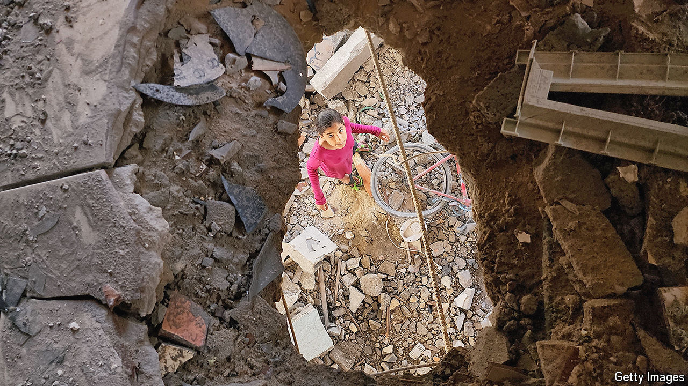

###### Israel in Gaza

# The Israeli army is caught in a doom loop in Gaza 

##### And the refusal to plan for the day after the war is fuelling a crisis with America 

 

> May 16th 2024 

IN RAFAH the stakes could not be higher. Supporters see Israel’s military offensive there, which began earlier this month, as a necessary assault on Hamas’s last bastion. Sceptics worry it will doom continuing talks about a hostage deal and, perhaps, the hostages themselves. Much of the world fears it will become a human tragedy, killing thousands of Palestinians and displacing a million more.

There was less drama around the Israeli campaign in Zeitoun, in northern Gaza, which began days after the fighting in Rafah. Instead there was a sense of déjà vu. Israel’s army fought there last year, at the start of this war, and returned for a two-week offensive in February. Now it is back for a third time, and perhaps not the last.

