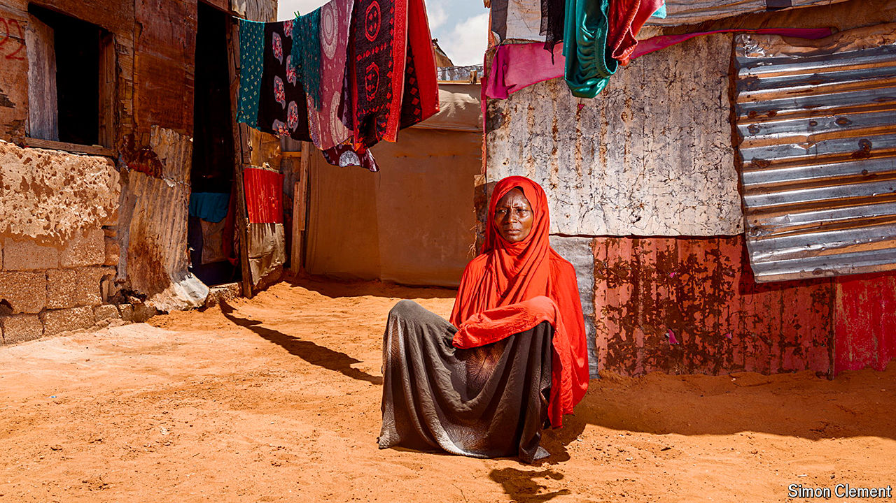

###### Somalia’s never-ending crisis

# War and climate change are overwhelming Somalia 

##### It has already been battered by three decades of conflict 

 

> May 16th 2024 

AS THE SUN beats down on the dusty yellow soil and a cluster of tin shacks near the city of Galkayo, in central Somalia, mothers point to their children, looking on shyly. Then almost all express variations of the same words: “I don’t know what I will feed them,” or “I have not cooked today because I have no food”. 

Theirs is a despair felt across a country where first it never rained, and then it poured. Between 2020 and late 2022 the rains, which usually come twice a year, failed five times in a row, causing Somalia’s worst drought in 40 years and pushing the country to the brink of a famine. Disaster was averted only by a $2.4bn emergency response led by the UN’s World Food Programme (WFP) and international charities including Save the Children. Then last year came the country’s worst flooding in a century, which swept away fields, driving up food prices, and forced more than a million people to leave their homes.

