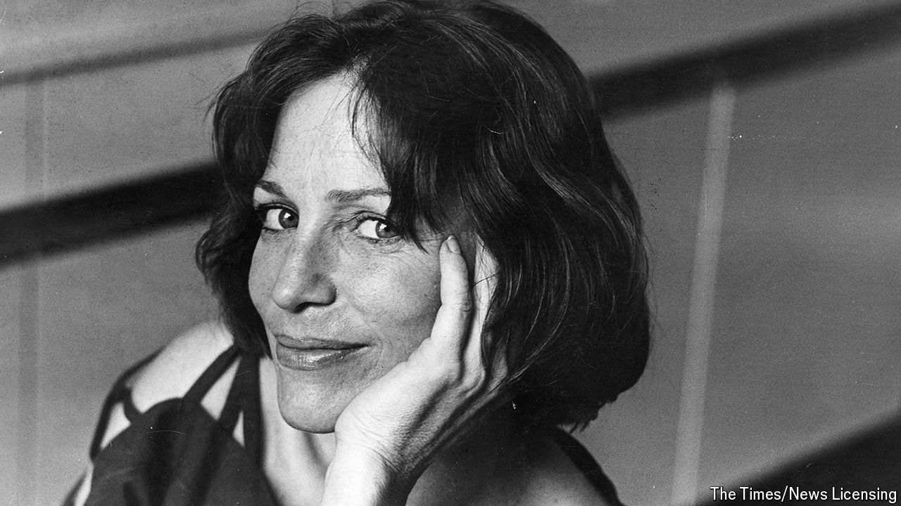

###### Life is too short to stuff a mushroom

# Shirley Conran wrote a bonkbuster to teach schoolgirls about sex 

##### The author and campaigner for maths education died on May 9th, aged 91 

 

> May 16th 2024 

Did it excite her? That was what people always wanted to know. They meant sexually, of course, though they didn’t dare to use that word. Did it excite her to write sex scenes? They all seemed to think that she was panting over her keyboard. Certainly Dame Shirley Conran wrote a lot about sex. And she did dare to use the word “sexual”—and indeed “panting”. Not to mention “gasping”, “throbbing” and “writhing”. But she didn’t find it arousing: she was too busy concentrating on her spelling.

People always asked her about sex. Afterwards, when “Lace”, her most famous book, had become an international bestseller and a TV series, and the word “bonkbuster” had entered the dictionary, people started treating her as an authority. When “Fifty Shades of Grey” came out, they asked her if she liked it. Not much, was the answer: it was 200 pages before there was any proper sex; 100 before the heroine even got whacked on the bottom by a hairbrush. But it did make its author, E.L. James, an awful lot of money, which she liked. She loved to see any woman making money. 

