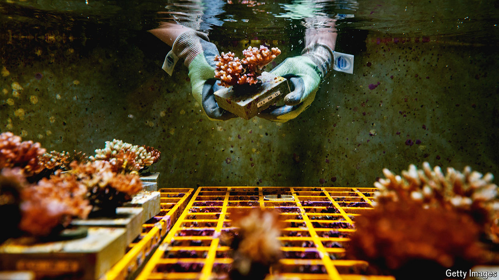

###### Reef-building

# Some corals are better at handling the heat 

##### Scientists are helping them breed 

 

> May 15th 2024 

CORAL REEFS, home to about a quarter of all known marine species, face an . Rising water temperatures cause the corals to expel their resident photosynthetic algae, bleaching them white and depriving them of their major food source.

But, says Joanie Kleypas of the National Centre for Atmospheric Research in Colorado, some corals are more resilient than others. For instance, corals in the Red Sea are able to withstand hotter temperatures, because they have had thousands of years to adapt to the heat. The issue right now, says Dr Kleypas, is that human activity has caused global temperatures to rise faster than natural selection can breed resilience.

