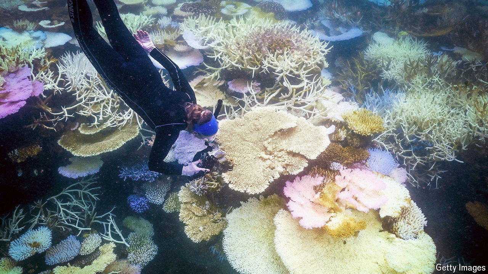

###### Coral hazard

# The Great Barrier Reef is seeing unprecedented coral bleaching 

##### Continued global warming will mean its obliteration 

 

> May 15th 2024 

THE GREAT Barrier Reef is a natural marvel. Spanning 2,300km along the north-east coast of Australia, this vast ecosystem boasts hundreds of species of multicoloured corals across an area roughly the size of Italy. Thousands of other marine species rely on it for their survival. But the rate at which Earth is warming leaves its future in doubt.

The southern-hemisphere summer that ended in February is likely to have been the deadliest in the reef’s history. What made it so was the unprecedented thermal stress—a measure of both high temperatures and their duration—it endured. In the reef’s southern third, where the stress was worst, sea-surface temperatures peaked at 2.5°C above average. It will be months before the consequences are clear, but some corals are already succumbing. Up to half may die, estimates Neal Cantin of the Australian Institute of Marine Science (AIMS).

