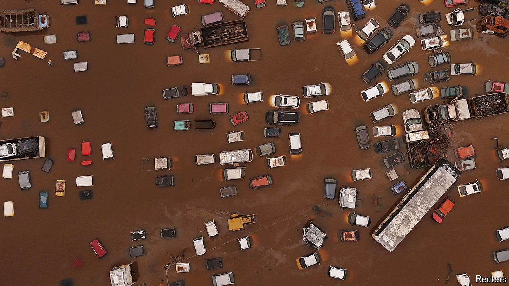

###### When the levee breaks

# Huge floods in Brazil’s south are a harbinger of disasters to come 

##### Climate change is making weather events more extreme in the region 

 

> May 16th 2024 

Torrential rains have been battering the southern Brazilian state of Rio Grande do Sul for almost three weeks. On May 2nd eight of the world’s ten rainiest cities were in the state. At least 150 people have died and 130 are missing. Six hundred thousand people have been made homeless. Many have no drinking water or electricity. “It’s like a war zone,” says Bruna Travi, a volunteer in Porto Alegre, the state capital. Civilians are using fishing boats and jet-skis to pull survivors out of the filthy water and bring them to shelters, which are largely supported by donations.

Rio Grande do Sul is among Brazil’s most prosperous states. Larger than Britain and home to 11m people, its fertile plains attracted millions of immigrants in the late 19th and early 20th centuries. They turned it into an agricultural powerhouse. As in neighbouring Uruguay and Argentina, the state’s people are called for their cowboy skills. Its output accounts for around 6% of Brazil’s GDP. It produces 70% of the country’s rice and is the world’s top exporter of tobacco. It is also a big producer of wheat, soy, cattle and cellulose. Just in the first four months of the year the state’s agricultural products accounted for $3bn in exports.

