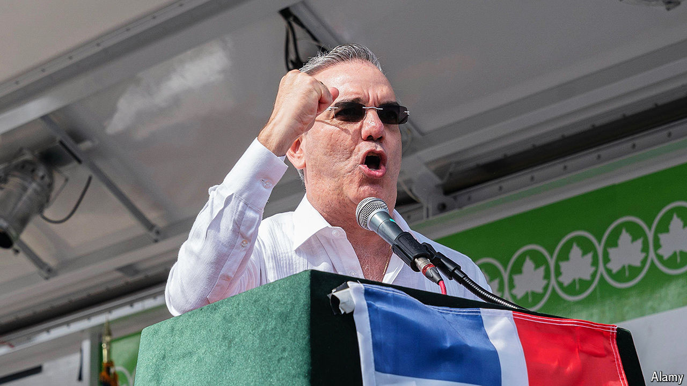

###### Elections in the Dominican Republic

# Luis Abinader is poised for a thumping re-election win 

##### Voters rate the management of economy and his fight against corruption 

 

> May 16th 2024 

President Luis Abinader of the Dominican Republic cuts a dull figure. First elected in 2020, the 56-year-old former businessman embodies the technocratic, market-friendly centrism that has long shaped Dominican politics. Yet his approval ratings hover around 70% and he is on course for a resounding re-election on May 19th. His Modern Revolutionary Party (PRM) is tipped to retain majorities in both houses of Congress.

Mr Abinader’s opponents are weak and divided. The Dominican Liberation Party (PLD), which ruled for 20 of the past 28 years, has been damaged by corruption scandals. Leonel Fernández, a former three-term president who quit the PLD in 2019, is running as a third-party candidate.

