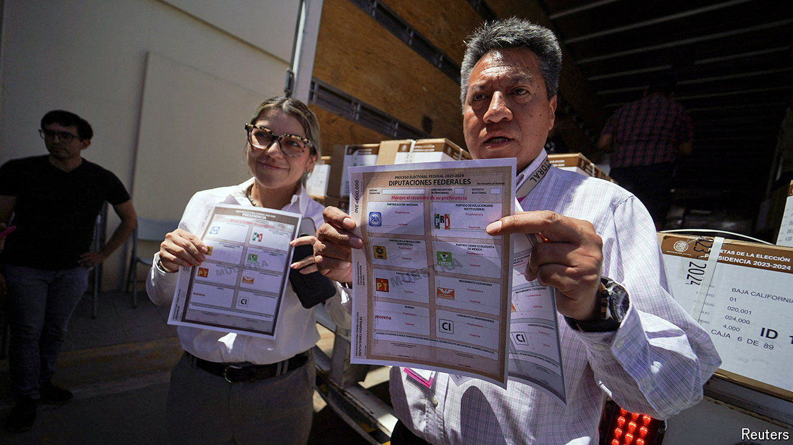

###### The other 19,999

# Why Mexico’s largest-ever election matters 

##### The results will determine the political environment in which Mexico’s next president operates 

 

> May 16th 2024 

On June 2nd almost 100m Mexicans will be eligible to cast a vote to elect the country’s next president. Claudia Sheinbaum of the ruling Morena party is likely to win comfortably. She holds a lead of 25 points in the opinion polls.

But the presidency is only one of some 20,000 jobs up for grabs in what will be Mexico’s largest election ever, measured by the number of voters and available posts. Mexicans will also elect representatives to all 628 seats in Congress, nine governors, more than 1,000 local legislators and some 18,000 municipal roles. The results will determine the political environment in which the next president will operate. They may also define the future of Mexico’s traditional opposition parties, which have been discredited since their last stint in power. “What is at stake is the democratic viability of Mexico: the possibility of having a party system that reflects the democratic pluralism of the country,” says Clemente Castañeda, a senator running for re-election with Citizens’ Movement, a relatively young progressive party.

