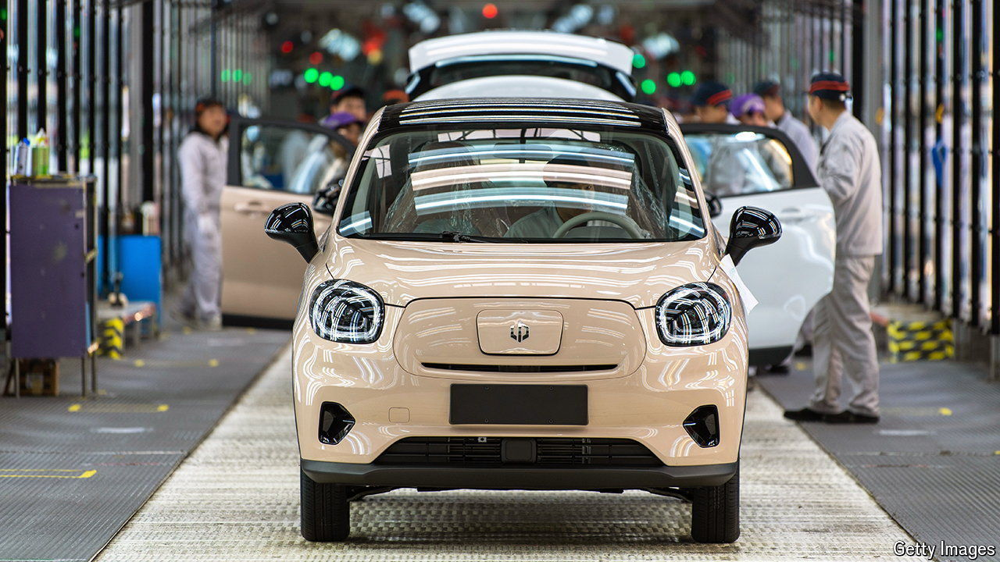

###### The world this week

# Business 

#####  

 

> May 16th 2024 

Joe Biden imposed another round of tariffs on Chinese exports to America, most notably increasing the duties on  to 100%. America imports relatively few Chinese EVs but Mr Biden suggested his steps were pre-emptive. Chinese carmakers are expanding in Europe, but “We’re not going to let China flood our market,” said the president, with one eye on votes in Michigan, the centre of America’s car industry and a crucial state in November’s election. Tariffs are also going up on semiconductors, solar cells and critical minerals. A furious China described the decision as “political manipulation” and vowed to retaliate. 

 decided to break up its business to fend off a revised takeover bid from ,valued at £34bn ($43bn). Anglo will divest its coking coal assets and spin off its platinum and De Beers diamonds divisions. It is also considering the options for its nickel business in order to focus on copper, iron ore and crop nutrients. The mining giant’s headquarters are in London but it employs 45,000 people in South Africa, where it was founded in 1917; the government there will want a say in any demerger or sale process. 

