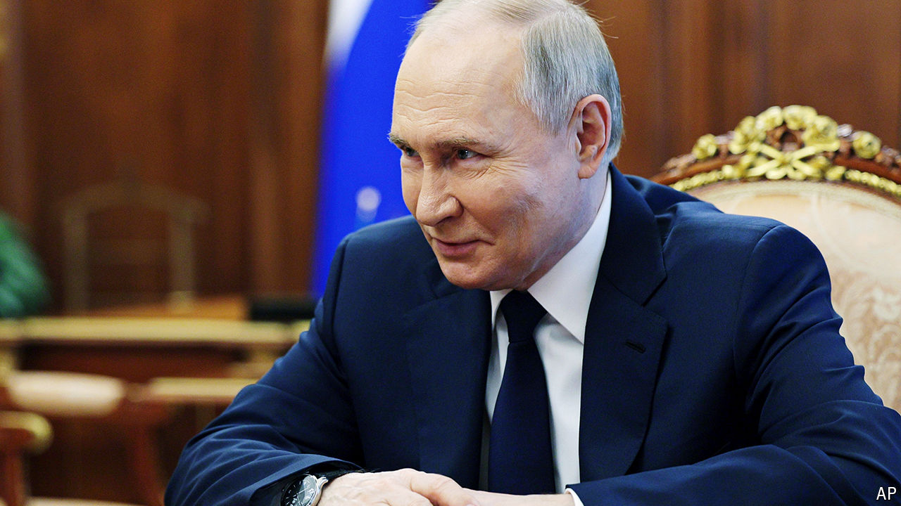

###### The world this week

# Politics 

#####  

 

> May 16th 2024 

In a surprise shake-up of  security apparatus, Vladimir Putin moved  from his job as minister of defence, a role he has held since 2012, to the national security council. His replacement is Andrei Belousov, an economist with no experience of security matters but who has worked extensively on military budgets. The changing of the guard will have little effect on operations in Ukraine. Mr Putin prefers to speak directly to Valery Gerasimov, his senior general in the field. Mr Belousov said his task was to achieve victory, but “with minimal human losses”, presumably just on the Russian side.

Mr Putin met his Chinese counterpart, , in Beijing. It was his first trip abroad since winning a sham election in March. The leaders reaffirmed their support for each other. Mr Xi has been accused by Western officials of propping up Mr Putin’s war machine in Ukraine.

