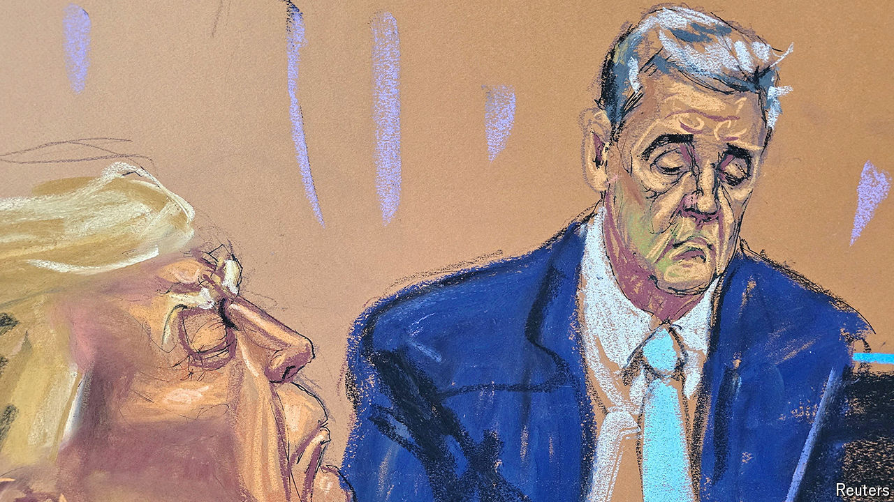

###### Hush puppy

# A mano-a-mano contest between Michael Cohen and Donald Trump 

##### The hush-money trial hinges on the testimony of the former president’s former fixer 

 

> May 15th 2024 

Jurors heard the voice before they saw the man. And what a voice: pushy, impolite, pure Long Island. A accent. Sometimes boastful, sometimes defensive, sometimes self-pitying, always mouthy. Days before he appeared in court to testify against his ex-boss and sworn enemy, prosecutors played a recording of a phone call during which Michael Cohen sounded terribly sorry for Michael Cohen. Or as he complained to the guy on the other end of the line: “Nobody is thinking about Michael. You understand?”

Now everybody is thinking about Michael. The man who once called himself Donald Trump’s “thug, pit bull and lawless lawyer” is the star witness in Manhattan prosecutors’ case against the former president. Only Mr Cohen can directly tie Mr Trump to the charged crimes. On the stand he was measured and doleful: less pit bull, more basset hound. He followed directions. And he told prosecutors exactly what they wanted to hear.

