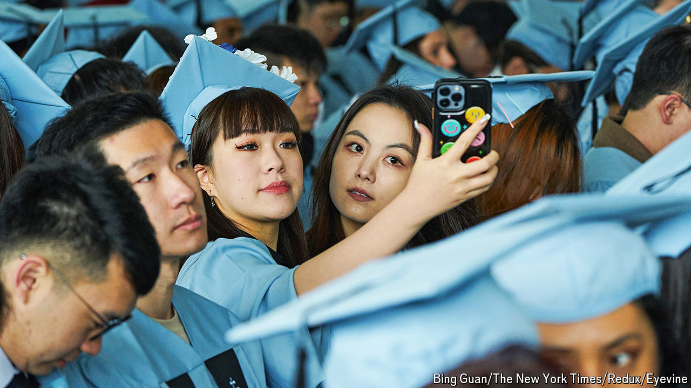

###### The kids are still alright

# After a season of Gaza protests, America’s university graduates are polarised but resilient 

##### After enduring covid and turmoil over free speech, the class of 2024 finally takes its bow 

 

> May 16th 2024 

The graduation speech is a dismal genre, typically a sermon about showing grit and finding your own path, leavened by dad jokes. America’s university graduating classes of 2024 are unlikely to mind. The great majority of them started college four years ago, amid peak covid. This spring, protests over the war in Gaza disrupted many campuses and led to nearly 3,000 arrests nationwide. At the hotspot of Columbia University in New York, classes went online again, triggering covid flashbacks. University leaders and police prepared this month for tense scenes at graduation ceremonies. 

Instead, something like normality has broken out. Despite the cancellation of the university-wide commencement, the scene was joyous at the smaller ceremony for Columbia’s main undergraduate college. Many students carried yellow inflated lions, the university mascot. Kathy Fang, the valedictorian, was among a couple of dozen students who wore , in solidarity with Palestinians, and when she walked across the stage to receive her diploma, she carried a sign saying “DIVEST.” But her peaceful protest—like many others at graduations elsewhere—was enveloped by the university’s cap-and-gown rituals. For once the clichés seemed apt. By showing grit over several years, the class of 2024 enjoyed the graduations many craved. 

