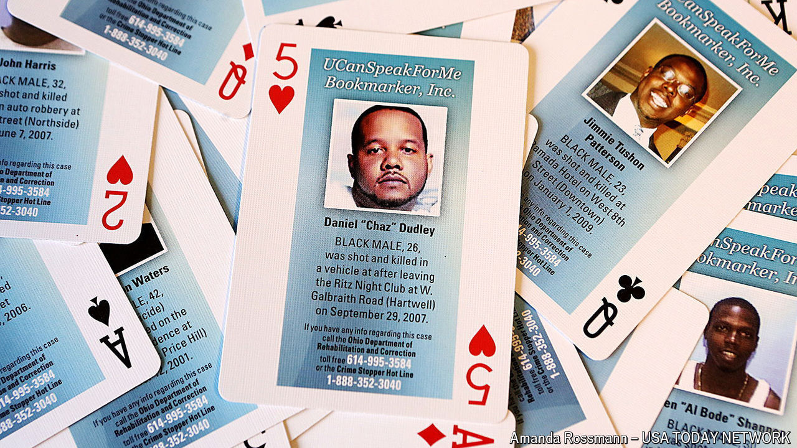

###### Stacking the deck

# Can playing cards help catch criminals? 

##### A novel idea for solving cold cases comes with high-stakes risks 

 

> May 16th 2024 

Despite facial recognition and other leapfrogs in technology it seems cops are getting no better at cracking crime. For the past decade the share of murders that has gone unsolved has risen. Since the pandemic it has climbed to around 50% for the first time since the FBI started counting. With more murderers at large, investigators are getting creative.

Last month Mississippi Coast Crime Stoppers, a group that feeds anonymous tips from the public to the police, sent 2,500 decks of playing cards to inmates in seven county prisons and jails. Instead of jacks and queens, each card has the photo of a gulf-coaster who disappeared or was mysteriously killed. The group hopes that while prisoners pass time playing spades or gin rummy, they will come across a case they know something about and call in. The strategy reportedly worked elsewhere: authorities in Connecticut say that over the years decks like these have helped the state solve 20 cold cases; South Carolina claims at least eight and Florida two.

