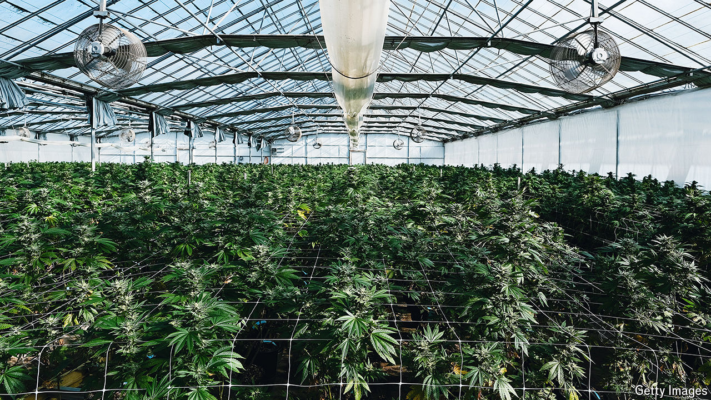

###### Spreading like a weed

# Marijuana is already legal for a majority of Americans 

##### National prohibition has not stifled budding entrepreneurs 

 

> May 16th 2024 

From the outside, the production facility in Webberville, a small town in central Michigan, does not look like much. The bare warehouse could be any sort of industrial facility. Even the sign with the company name, C3 Industries, does not give much away. But for those of a certain disposition, getting the chance to enter would be a bit like winning a golden ticket to Willy Wonka’s factory. For this facility is one of America’s larger cannabis-production facilities. Within its walls are roughly 125,000 square feet of greenhouses, filled with thousands of spiky plants, each with a distinctive yellow tag hanging from it. Sneak away and taste the product and you will not literally float like Mr Wonka’s visitors. But it might feel like it.

In a year the factory will produce 40,000 pounds (18,100 kilograms) of weed, with fewer than 100 workers. All manner of high-tech wizardry is involved. In the greenhouses temperature, light and moisture are all automatically adjusted. At harvest, threshing machines separate the bud, leaves and stems. Distillation machines heat some of the produce to break out pure thc—the primary active ingredient of marijuana. Another machine automatically mixes this with glycerin to make vape juice. All through the process those yellow tags follow the produce, allowing officials to trace the provenance of any cannabis product made in the factory.

