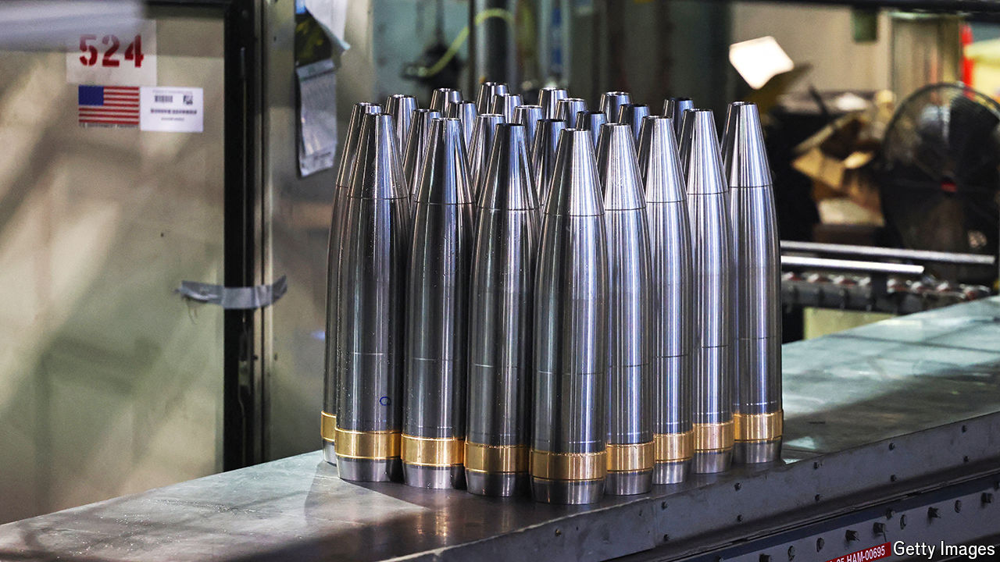

###### Bombs, away

# The Biden administration is trying to walk a fine line in arming Israel 

##### It may please no one as a result 

 

> May 16th 2024 

After failing for months to unite behind major legislation, Republicans in the House of Representatives have turned to an agenda better suited to their disposition: trolling Democrats with tough votes on divisive issues. And Republican leaders started with the starkest policy disagreement within the Democratic Party today. The Israel Security Assistance Support Act would stop Joe Biden from blocking military assistance to Israel. Republicans were aiming to bring it up for a vote no later than May 17th, and the White House quickly became worried that pro-Israel Democrats would defy the president.

While Mr Biden repeatedly has vowed “ironclad” support for Israel, he also imposed a pause on some munitions transfers earlier this month and threatened to withhold them entirely if Israel invades Rafah, in southern Gaza. A State Department report published on May 10th criticised Israel’s conduct but did not trigger any policy changes. Has the White House’s support for the Israel Defence Forces violated the law or administration guidelines? Would stopping aid have a material effect on IDF operations?

